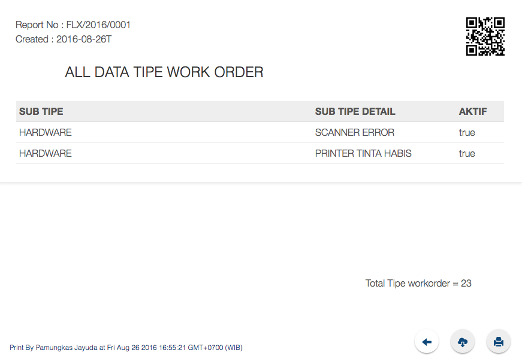

# flx-report

## Install
add jayuda:flx-report to your project

## Screen Shoot


## Usage
create route report
```javascript
Router.route('/report', function () {
	this.render('flxreport');
});
```

Set Session parameter
```javascript

var sReportName = "NAME OF YOUR REPORT";
var sReportNumber = "NO REPORT";
var sReportFootNote = "any footnote to your report";
var sCollections = "name of collections";
var sBackUrl = "router on back buttons";
var cCollectionsInitial = DECLARATIONCOLLECTIONS;
var aReportFilter = {"FILTER REPORT TO YOUR collections"};
var aReportOptions = {"ANY OPTION (SORT, FIELDS, LIMIT)"};
var oReportFieldDisplay = [
	{"NAMA":"NAME TO display", "fields": "NAME FIELDS ON collections"}
];


Session.set("reportNama", sReportName);
Session.set("reportKolom", oReportFieldDisplay);
Session.set("reportCollections", sCollections);
Session.set("reportBackUrl", sBackUrl);
Session.set("reportCollectionsAll", cCollectionsInitial.find(aReportFilter,aReportOptions).fetch());
Session.set("reportNumber", sReportNumber);
Session.set("reportFootnote", sReportFootNote);

Router.go("report");
```

add template menu
```
<template name="menuDownload">
    <div style="position: fixed; bottom: 20px; right: 80px;z-index: 1000;">
        <a href="#" class="download btn btn-fab btn-fab-mini btn-raised shadow-z-4 shadow-z-2" style="color:{{sHeaderBackground}};"><span class="glyphicon glyphicon-cloud-download" style="color:{{sHeaderBackground}};color: {{sGeneralFont}};font-size: large;position: relative;top:7px;"></span></a>
    </div>
</template>
<template name="menuPrint">
    <div style="position: fixed; bottom: 20px; right: 20px;z-index: 1000;">
        <a href="#" class="print btn btn-fab btn-fab-mini btn-raised shadow-z-4 shadow-z-2" style="color:{{sHeaderBackground}};"><span class="glyphicon glyphicon-print" style="color:{{sHeaderBackground}};color: {{sGeneralFont}};font-size: large;position: relative;top:7px;"></span></a>
    </div>
</template>
<template name="menuBackBottom">
    <div style="position: fixed; bottom: 20px; right: 140px;z-index: 1000;">
        <a href="#" class="back btn btn-fab btn-fab-mini btn-raised shadow-z-4 shadow-z-2" style="background-color:{{sHeaderBackground}};"><span class="glyphicon glyphicon-arrow-left" style="background-color:{{sHeaderBackground}};color: {{sGeneralFont}};font-size: large;position: relative;top:7px;"></span></a>
    </div>
</template>
<template name="menuLoadMore">
  <a href="#" class="loadmore btn btn-fab btn-fab-mini btn-raised shadow-z-4 shadow-z-2" style="background-color:white;position:absolute;right:50%;"><span class="glyphicon glyphicon-menu-down" style="background-color:{{sHeaderBackground}};color: {{sGeneralFont}};font-size: large;position: relative;top:7px;"></span></a>
</template>
<template name="footNoteReport">
    <div style="position: fixed; bottom: 20px; left: 20px;z-index: 1000;">
        <a href="#" class="print" style="color:{{sHeaderBackground}};font-size: smaller;"> Print By {{username}} at {{datePrint}} </a>
    </div>
</template>

```
